# 说明

- 目的：学习java字节码文件内容结构、混淆与反混淆类型、asm原理学习。
- 这是第一次，也是最后一次。国内就没有能够讨论技术的环境，全靠自学和用爱发电，靠北了。
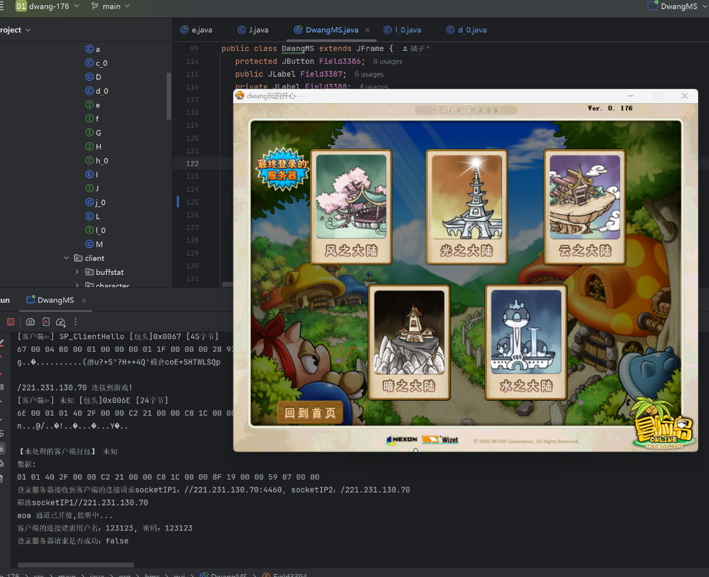

# 思路

- 反混淆jar
- jar包解成代码手动修复反编译
- 参考其他端给176命名

## Step1 代码反混淆

**下载java-deobfuscator**

<https://github.com/java-deobfuscator/deobfuscator>

使用源码编译可以自定义一些transformer进行处理

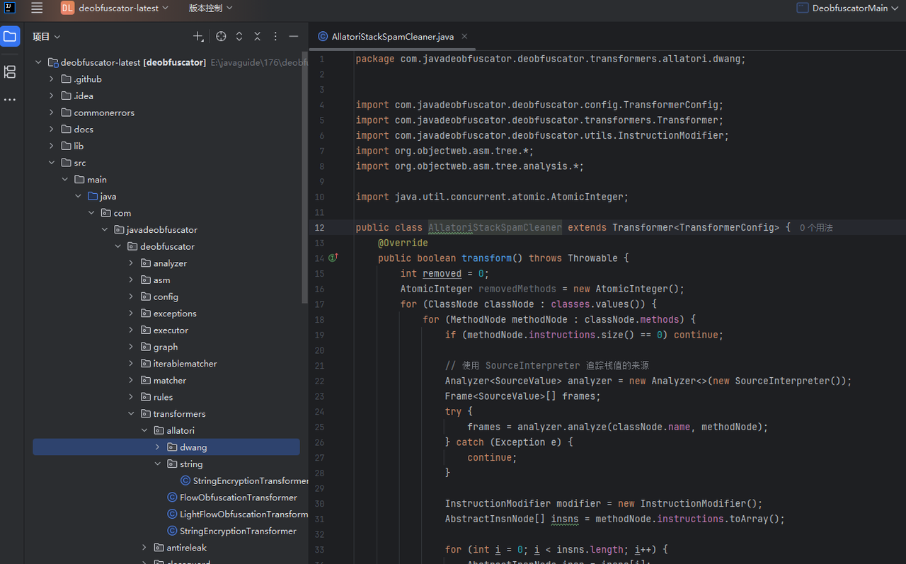

**1.0 去掉加密字符串**

自己写了一个transform，去掉加密的没用代码，但是删除了会报字节码删除错误。先用官方的来去除加密字符串

```Python  
input: E:\\javaguide\\176\\step1_去混淆字符串\\1.0\\input.jar
output: E:\\javaguide\\176\\step1_去混淆字符串\\1.0\\output.jar

transformers:
  - com.javadeobfuscator.deobfuscator.transformers.allatori.string.StringEncryptionTransformer
  - com.javadeobfuscator.deobfuscator.transformers.allatori.FlowObfuscationTransformer
  - com.javadeobfuscator.deobfuscator.transformers.general.peephole.PeepholeOptimizer

libraries:
  - "E:/javaguide/176/allatoriMs/lib/netty-all-4.1.51.Final.jar"
  - "E:/javaguide/176/allatoriMs/lib/js-1.7R2.jar"
  - "E:/javaguide/176/allatoriMs/lib/yuicompressor-2.4.8.jar"
  - "E:/javaguide/176/allatoriMs/lib/kryo-5.0.0-RC8.jar"
  - "E:/javaguide/176/allatoriMs/lib/spring-tx-5.2.8.RELEASE.jar"
  - "E:/javaguide/176/allatoriMs/lib/spring-core-5.2.8.RELEASE.jar"
```
PeepholeOptimizer包含了好几个优化，需要加启动参数

\-Xss5M

但是这个有问题，会有一些方法看不到。后面放弃使用PeepholeOptimizer

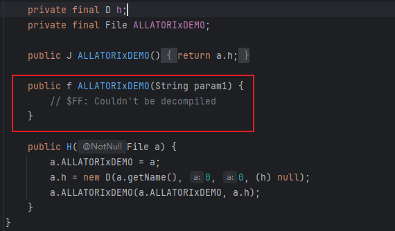

com.javadeobfuscator.deobfuscator.transformers.allatori.FlowObfuscationTransformer

官方这个包有实现很多有用的部分，去掉了很多冗杂的方法。但是需要源码修改跳过一些方法才可以使用。

**1.1 非法文件去除**

问题1：方法签名不同，不一定可以编译通过。返回值不同也不能编译通过。但是JVM可以正常执行。

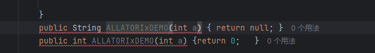

使用反混淆时候加上重命名

```Plain Text  
input: E:\\javaguide\\176\\step1_去混淆字符串\\1.1\\input.jar
output: E:\\javaguide\\176\\step1_去混淆字符串\\1.1\\output.jar
transformers:
  - com.javadeobfuscator.deobfuscator.transformers.general.removers.IllegalAnnotationRemover
  - com.javadeobfuscator.deobfuscator.transformers.general.removers.IllegalSignatureRemover
  - com.javadeobfuscator.deobfuscator.transformers.general.removers.IllegalTypeAnnotationRemover
  - com.javadeobfuscator.deobfuscator.transformers.general.removers.IllegalVarargsRemover
  - com.javadeobfuscator.deobfuscator.transformers.general.removers.LineNumberRemover
  - com.javadeobfuscator.deobfuscator.transformers.general.removers.LocalVariableRemover
  - com.javadeobfuscator.deobfuscator.transformers.general.removers.SyntheticBridgeRemover

libraries:
  - "E:/javaguide/176/allatoriMs/lib/netty-all-4.1.51.Final.jar"
  - "E:/javaguide/176/allatoriMs/lib/js-1.7R2.jar"
  - "E:/javaguide/176/allatoriMs/lib/yuicompressor-2.4.8.jar"
  - "E:/javaguide/176/allatoriMs/lib/kryo-5.0.0-RC8.jar"
```

1.1去掉了很多无用代码，而且很多隐藏方法可以被看到。基本到这一步可以开始进行下一阶段：反编译获取代码

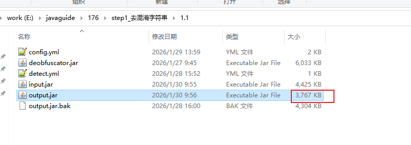

**1.2 删除所有没有引用关系的方法**

因为加密字符串已经1.0 解密了。所以对应的加密方法已经没有存在的必要了。应该可以删除才对，原本的解密方法通常如下所示：input output都是String的ALLATORIxDEMO

```Plain Text  
// 假设你已经知道这个解密方法的名字和描述符
String decryptMethodName = "ALLATORIxDEMO";
String decryptMethodDesc = "(Ljava/lang/String;)Ljava/lang/String;";

for (ClassNode classNode : classes.values()) {
    // 移除匹配的方法定义
    classNode.methods.removeIf(m -> 
        m.name.equals(decryptMethodName) && m.desc.equals(decryptMethodDesc)
    );
}
```
- 有些方法名不对没删掉，也是解密方法的，
- 还有一些解密方法还是有调用的，但是删掉了会出问题，需要在1.1里面去找对应的String方法

CharacterIdChannelPair中

虽然是解密方法，但是方法名不是ALLATORIxDEMO，而是带序号重新命名过的

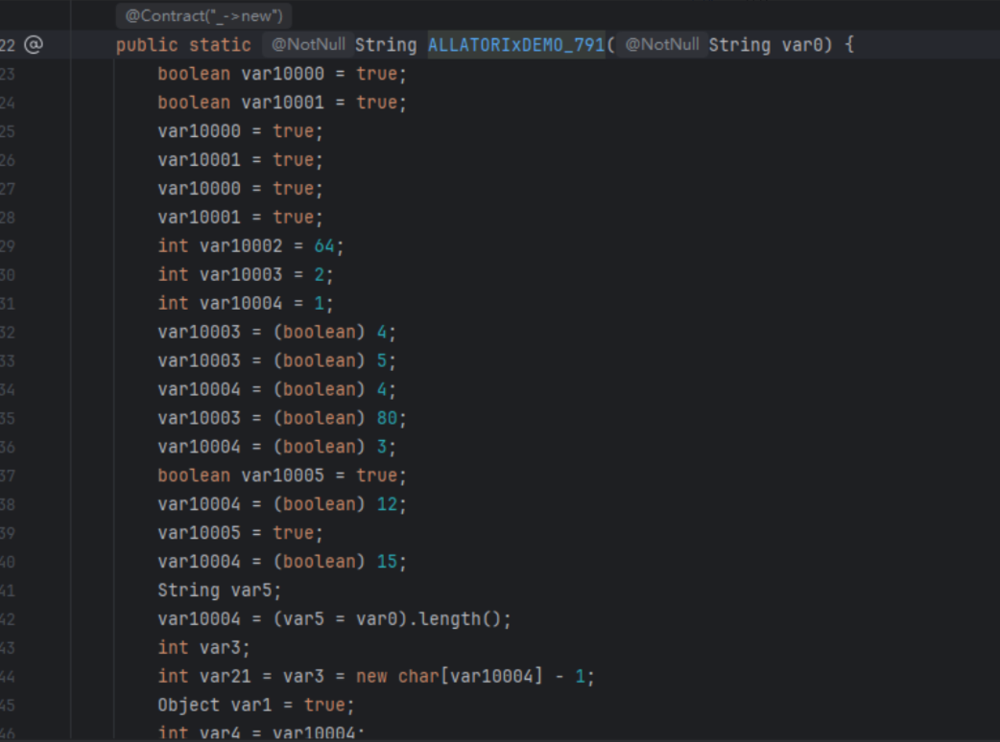

```angular2html
input: E:\\javaguide\\176\\step1_去混淆字符串\\1.2\\input.jar
output: E:\\javaguide\\176\\step1_去混淆字符串\\1.2\\output.jar
transformers:
- com.javadeobfuscator.deobfuscator.transformers.allatori.dwang.DeleteAllatoriDecriptMethods
libraries:
- "E:/javaguide/176/allatoriMs/lib/netty-all-4.1.51.Final.jar"
- "E:/javaguide/176/allatoriMs/lib/js-1.7R2.jar"
- "E:/javaguide/176/allatoriMs/lib/yuicompressor-2.4.8.jar"
- "E:/javaguide/176/allatoriMs/lib/kryo-5.0.0-RC8.jar"


```
**1.3 删除不用的变量(自定义)，格式化**

```angular2html
input: E:\\javaguide\\176\\step1_去混淆字符串\\1.3\\input.jar
output: E:\\javaguide\\176\\step1_去混淆字符串\\1.3\\output.jar
transformers:
- com.javadeobfuscator.deobfuscator.transformers.normalizer.DuplicateRenamer
- com.javadeobfuscator.deobfuscator.transformers.normalizer.FieldNormalizer
- com.javadeobfuscator.deobfuscator.transformers.normalizer.EnumNormalizer
- com.javadeobfuscator.deobfuscator.transformers.allatori.dwang.AllatoriStackSpamCleaner

libraries:
- "E:/javaguide/176/allatoriMs/lib/netty-all-4.1.51.Final.jar"
- "E:/javaguide/176/allatoriMs/lib/js-1.7R2.jar"
- "E:/javaguide/176/allatoriMs/lib/yuicompressor-2.4.8.jar"
- "E:/javaguide/176/allatoriMs/lib/kryo-5.0.0-RC8.jar"
```


可以删除部分，但是还是有挺多,这里用了自定义的transformer去删除解密函数拿出来旧的没有引用的参数


第二个版本：com.javadeobfuscator.deobfuscator.transformers.allatori.dwang.AllatoriStackSpamCleaner

```package com.javadeobfuscator.deobfuscator.transformers.allatori.dwang;
import com.javadeobfuscator.deobfuscator.config.TransformerConfig;
import com.javadeobfuscator.deobfuscator.transformers.Transformer;
import com.javadeobfuscator.deobfuscator.utils.InstructionModifier;
import org.objectweb.asm.tree.AbstractInsnNode;
import org.objectweb.asm.tree.ClassNode;
import org.objectweb.asm.tree.MethodNode;
import org.objectweb.asm.tree.analysis.Analyzer;
import org.objectweb.asm.tree.analysis.Frame;
import org.objectweb.asm.tree.analysis.SourceInterpreter;
import org.objectweb.asm.tree.analysis.SourceValue;

import java.util.concurrent.atomic.AtomicInteger;

public class AllatoriStackSpamCleaner extends Transformer<TransformerConfig> {
    @Override
    public boolean transform() throws Throwable {
        int removed = 0;
        AtomicInteger removedMethods = new AtomicInteger();
        for (ClassNode classNode : classes.values()) {
            for (MethodNode methodNode : classNode.methods) {
                if (methodNode.instructions.size() == 0) continue;

                // 使用 SourceInterpreter 追踪栈值的来源
                Analyzer<SourceValue> analyzer = new Analyzer<>(new SourceInterpreter());
                Frame<SourceValue>[] frames;
                try {
                    frames = analyzer.analyze(classNode.name, methodNode);
                } catch (Exception e) {
                    continue;
                }

                InstructionModifier modifier = new InstructionModifier();
                AbstractInsnNode[] insns = methodNode.instructions.toArray();

                for (int i = 0; i < insns.length; i++) {
                    AbstractInsnNode insn = insns[i];
                    if (insn.getOpcode() == POP || insn.getOpcode() == POP2) {
                        Frame<SourceValue> frame = frames[i];
                        if (frame == null) continue;

                        // 获取 POP 弹出的那个值
                        SourceValue poppedValue = frame.getStack(frame.getStackSize() - 1);

                        // 检查这个值的来源
                        boolean allSourcesAreLdc = true;
                        if (poppedValue.insns.isEmpty()) allSourcesAreLdc = false;

                        for (AbstractInsnNode source : poppedValue.insns) {
                            if (source.getOpcode() != LDC) {
                                allSourcesAreLdc = false;
                                break;
                            }
                        }

                        // 如果这个 POP 弹出的值仅仅是为了清理之前的 LDC
                        if (allSourcesAreLdc) {
                            // 删除所有的来源 LDC
                            for (AbstractInsnNode source : poppedValue.insns) {
                                modifier.remove(source);
                            }
                            // 删除当前的 POP
                            modifier.remove(insn);

                            // 【重要】还需要清理中间产生的 DUP_X1/DUP_X2
                            // 这里我们简单处理：寻找夹在中间的 DUP 操作并根据情况移除
                            // 更稳妥的方法是再次运行分析或将 DUP 替换为 NOP
                            cleanUpIntermediateDups(methodNode, modifier, poppedValue);

                            removed++;
                        }
                    }
                }
                modifier.apply(methodNode);
            }


        }
        logger.info("清理了 {} 处 Allatori 栈垃圾注入", removed);
        return removed > 0;
    }

    private void cleanUpIntermediateDups(MethodNode method, InstructionModifier modifier, SourceValue value) {
        // 这里的逻辑较为复杂，通常 Allatori 的 DUP_X 是为了把 LDC 藏起来
        // 如果 LDC 删了，对应的 DUP_X 必须换成简单的 DUP 或者删除
        // 建议配合 java-deobfuscator 的 ConstantPropagator 使用效果更佳
    }
}
```

比较包名

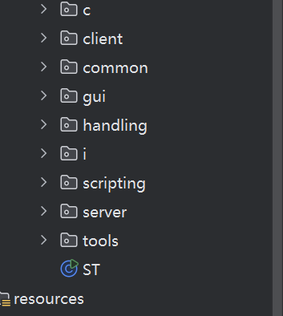
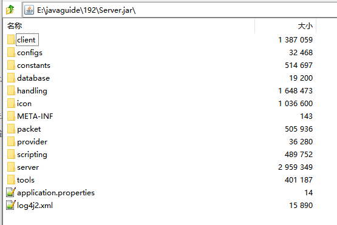

c：文件夹 加载wz的，里面都是实现的线程。应该是provider

i：是packet的文件夹

## Step2 手动修复

**看汇编心得**

- ax、a大概率标识this是自己。
- 那些没有引用的方法就是某个stream需要调用的方法，需要注意特别是ALLATORIxDemo名字的方法。还有没有名字的方法
- 很多类都可以拆开的否则一个方法过大

**问题记录**

手动修复很多问题，进行记录

**init方法根本看不懂**

那是因为没有用com.javadeobfuscator.deobfuscator.transformers.allatori.FlowObfuscationTransformer

第一步用了就好了

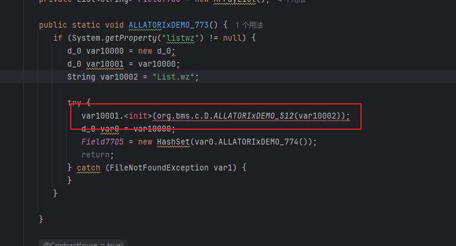

**方法重载**

大量的方法重载，需要手动去修复。JDK8的stream流不知道选择哪个重载的方法，可能需要方法重命名。但是有一些方法发是带有意义的。所以不能在反混淆的过程全部重命名。

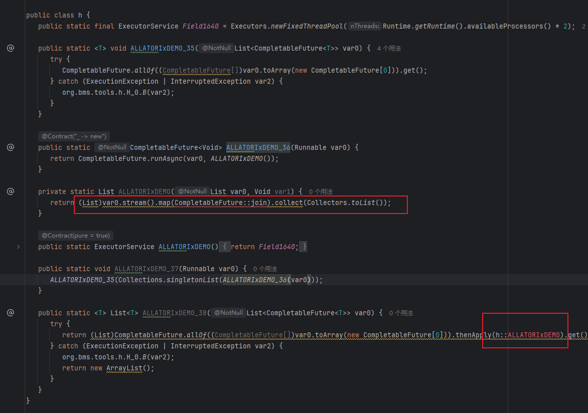

**null.方法**

反编译出来很奇怪很多null.方法，没找到对应类会被映射成NULL类

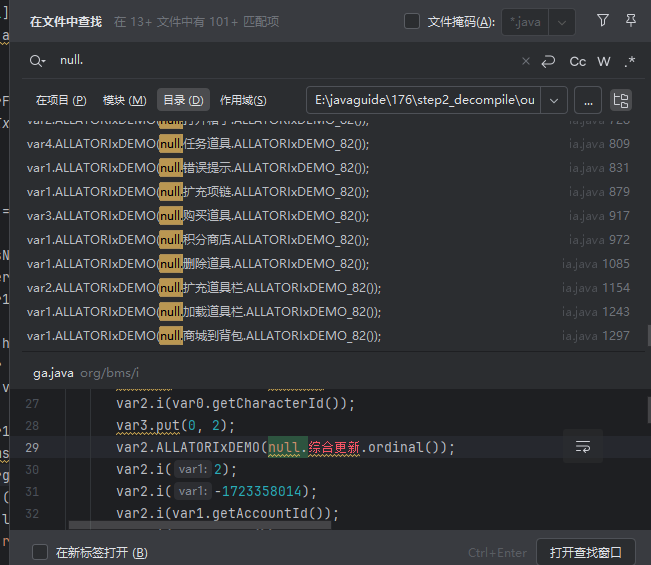

**错误的映射数组**

很多这种类型报错：

```text

报错原因：  
数组初始化错误（第27-46行）：在 ALLATORIxDEMO(long\[\] var0, int var1) 方法中，反编译器错误地将 long\[\] var2 = new long\[var1\] 变成了 Object var2 = true  
静态代码块错误（第72-924行）：  
大量出现 ((Object\[\])true)\[0\] = (boolean)"赵"; 这样的错误  
实际应该是 var10000\[0\] = "赵";  
第534行和第923行的赋值也错误：Field1779 = true; 应该是 Field1779 = var10000;

```
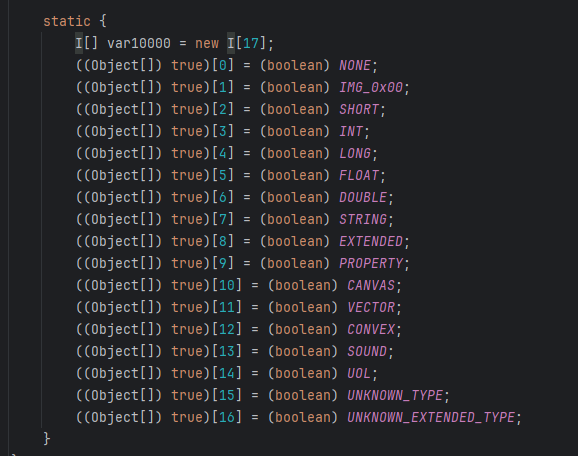


**stream匿名方法引用错误**

错误的：

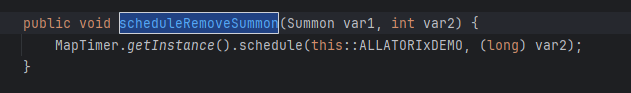

正确的：

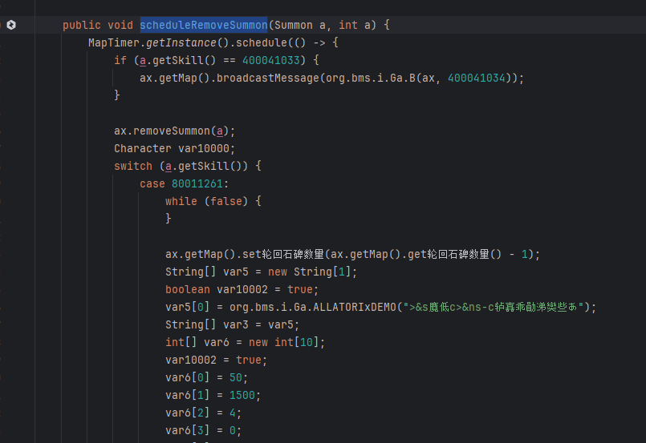

不知道为什么会被引用

只要是steam就有有这个问题：

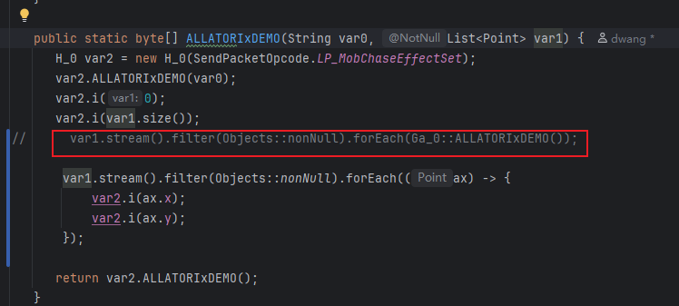

**关联到timer都有问题**

Stream流导致的，同上

**关联对应的位置**

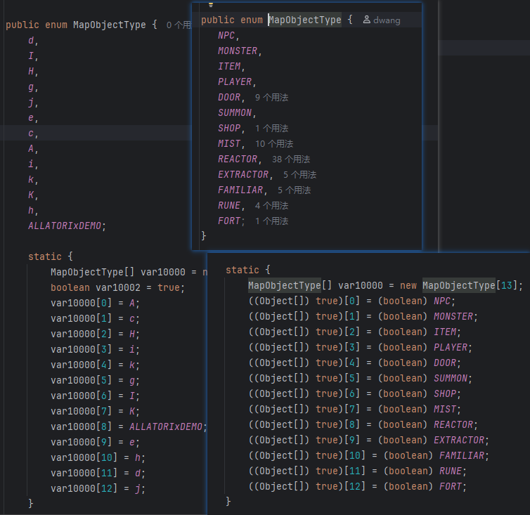

**匿名内部类会有BUG 找不到参数**

需要外部类.this标识是外部类的对象

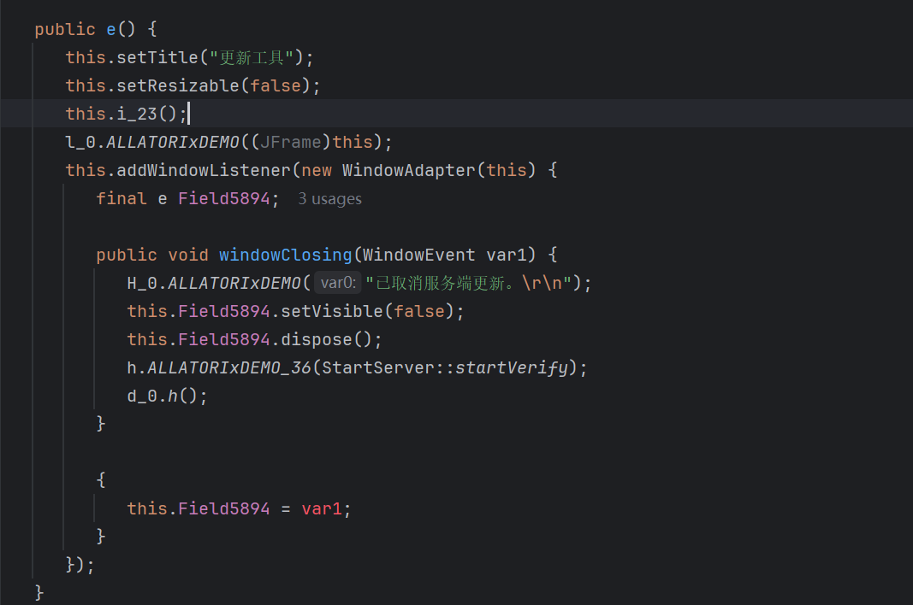

Var -> se.this

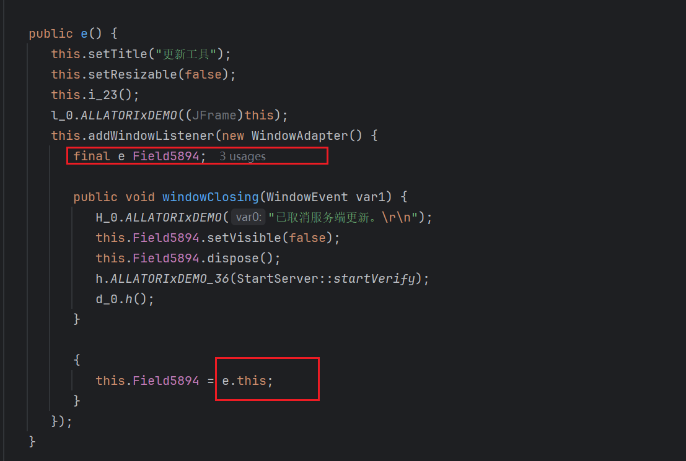


**桥方法当成源方法**

Comparable的名字

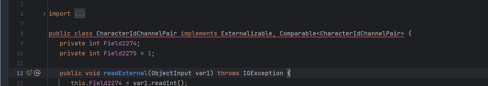

循环调用的名字

反编译器 **错误地把"桥方法"当成源码方法**

需要把桥方法删掉

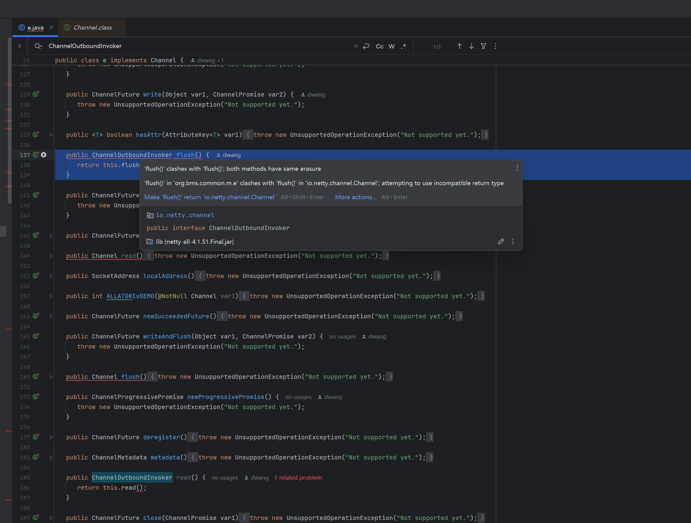

**String ALLATORIxDEMO（String）的方法缺失**
因为把解密方法删了，导致有部分需要还原的代码无法还原

>如果直接跳过1.0 执行1.1是否可以看到ALLATORIxDEMO 里面调用的具体是哪个ALLATORIxDEMO？
可以

**查找未引用的方法，可能是需要引用的。**

代码里面一般不会有没执行的方法，因为执行过一遍没执行的方法会被删掉

**解决：Couldn't be decompiled**

从jump 1.1里面拿到所有的方法，然后修复

注意可能有重命名的方法ALLATORIxDEMO 实际为ALLATORIxDEMOxxx

**解决接口方法**

有一些方法source.jar没有，但是实际却使用的方法在api会被编译成private方法，导致有问题

**接口的private去掉，jdk8不支持private的方法**
这个i 方法是1.1之后才有的。

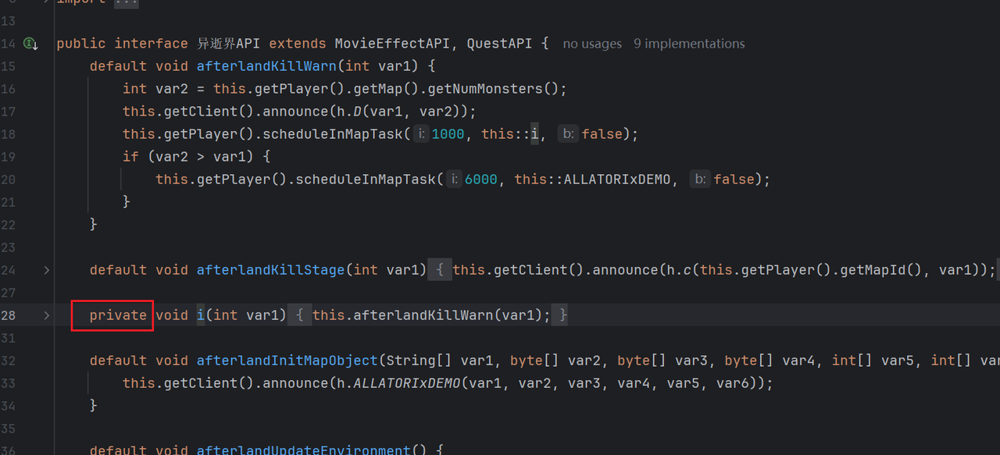


**inherits unrelated defaults for ALLATORIxDEMO() from types PlayerAPI and QuestAPI**

需要接口自己去实现一个空方法，解决不知道使用哪个父类的方法问题

```java
public interface V172新复古API extends QuestAPI, MovieEffectAPI {
    default void ALLATORIxDEMO() {
    }
}
```


**反编译初始化final顺序BUG**

会导致静态final变量比对象创建时间晚，先调用构造函数报错

👉 **Field8101 在构造函数里是 null，是因为 MapleUnion 的静态对象 Field8096 在它之前初始化，触发了构造函数，但此时 Field8101 还没执行静态初始化。**

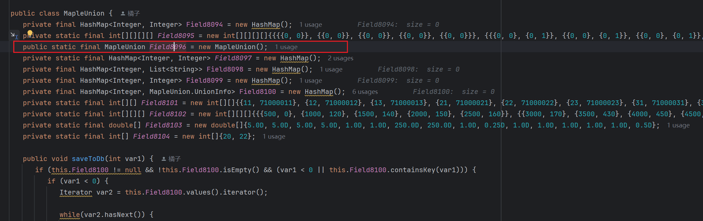


**new Object\[0\] 问题**

映射错误，实际是有对应类型的

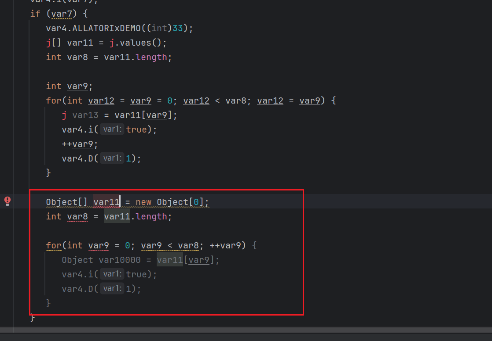

**封包错误 - 混淆方法调用错误**

**_T.Q 初始化_定时邀请活动_详情 --》这个包发完就闪退了_**

日志封包还没有这个包很奇怪，中间三个都没有

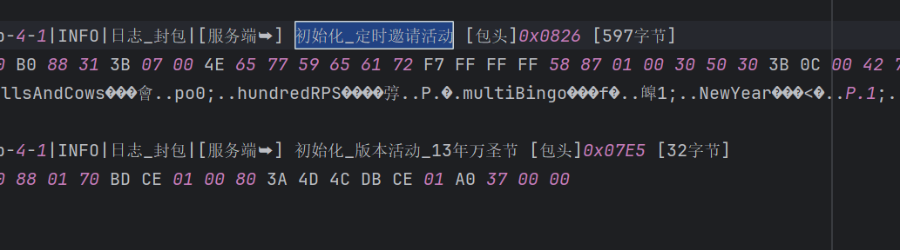

中间三个包根本没发

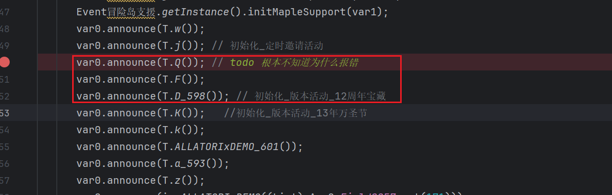

基本上比他发的数据都多5个0 - -


Plain Text  
~~02 00 00 00 2E 3B 00 00 00 00 00 00 00 00 00 00~~  
00 00 00 00 00 00 00 00 00 00 00 00 00 00 00 00  
<br/>~~02 00 00 00 2E 3B 00 00 00 00 00 00 00 00 00 00~~  
00 00 00 00 00 00 00 00 00 00  
<br/><br/>

找到原因了。映射的方法错了，混淆的方法是会有这个问题，不知道调用哪个同名的方法

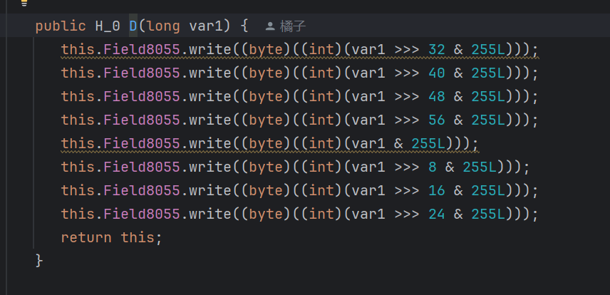

实际要用的encodeShort的方法
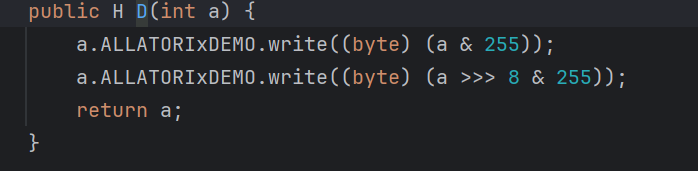

**java: 非法字符: '\\ue63b'**

scan_dir('I://game//ms//cms176//cms-176//org')

复制项目到别的地方即可

**加载自定义库**
```
    <dependency>
        <groupId>local.lib</groupId>
        <artifactId>a</artifactId>
        <version>1.0</version>
        <scope>system</scope>
        <systemPath>${project.basedir}/lib/a.jar</systemPath>
    </dependency>

```


**Step3 启动**
IDEA启动源码


